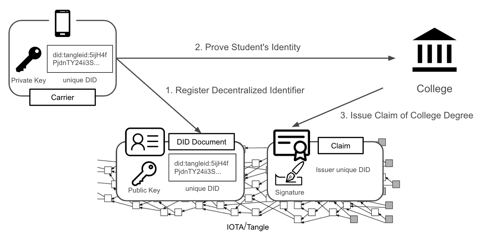
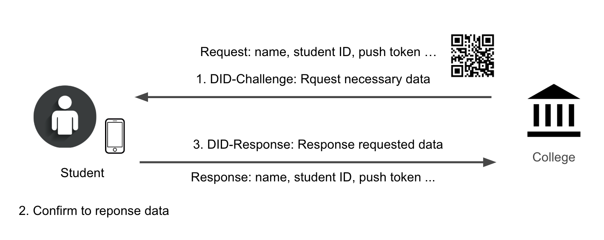
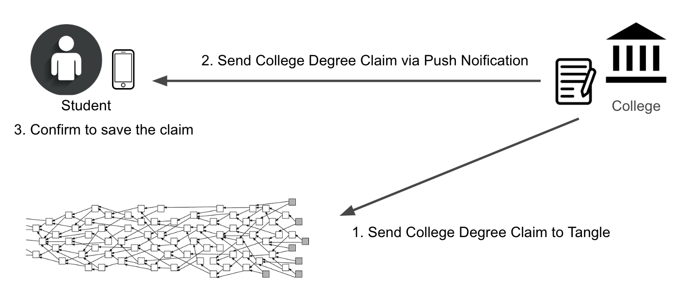

# TangleID Demo Site

This demo site is designed to illustrate the course site issue an claim to the participants.



In this scanerio, contain the following roles:
 - Carrier: A holder that holds the student personal data and claims.
 - College: An issuer that verify the student personal data and issue the certification claim to student.

### Register Decentralized Identifier

In the first step, the student download the mobile App, fullfill the personal information and register the Decentralized Identifier to the Tangle.

### Prove Own Control of Student Identity



In the college website, it is requesting student to give the necessary data to prove it own control of student idenity.

By scanning the QR Code, the student can decide to provide these data or not.

After the student confirm to provide these data, the website receive and verify these data, then login the student.

### Issue College Degree Claim



After the student logined, the student can request the college to issue the certification claim.

The website will issue the certification claim to the Tangle, then give it to the student by push notification.

## Contributing

### Getting Started

Clone the repository.

```shell
$ git clone git@github.com:TangleID/demo-site.git
```

Install the package dependencies.

```shell
$ cd demo-site
$ yarn
```

Launch the app.

```shell
$ yarn start
```

## Licensing
This website is freely redistributable under the MIT License. Use of this source
code is governed by a MIT-style license that can be found in the `LICENSE` file.
